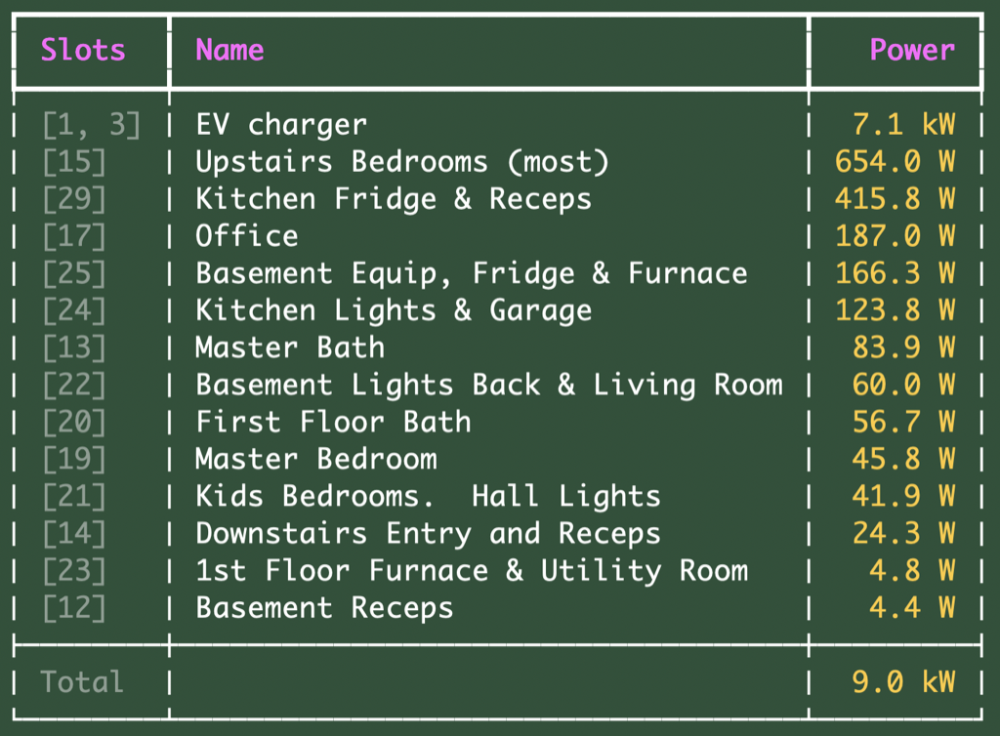

# SPAN Smart Panel CLI Tool

This is a small python cli script to gather circuit power usage from a SPAN.io
smart panel and display it in a sorted fashion sort of like the "top" command.
This is based on work by [hyun007](https://gist.github.com/hyun007/c689fbed10424b558f140c54851659e3).  

*This is experimental.  SPAN does not yet offer an official API, so it may disappear or break at any time.*




# Usage

```
usage: span.py [-h] [--ip IP] [--token TOKEN] [-z]

Display Span Status

options:
  -h, --help            show this help message and exit
  --ip IP               SPAN ip address
  --token TOKEN         bearer token
  -z, --include-zeroes  Include circuits with zero power
```


# Getting the token and Testing

The SPAN Web UI login page will appear on the local IP of the SPAN panel ('http' port 80). 
It prompts for a password or instructs that you can push the door button (the switch at the top that closes when you close the door) three times to open up access for a set time. You can then log into the web UI without the password. At that point you can see the calls that it is making by e.g. using your web browsers developer tools... Look at the request header of one of the /circuits requests and just copy the bearer token from it. Paste it in replacing the ones in the examples above, e.g.

You can test access by fetching the circuits endpoint:

```
curl -X GET "http://[MY IP]/api/v1/circuits" -H "Authorization: bearer [MY TOKEN]“
```


